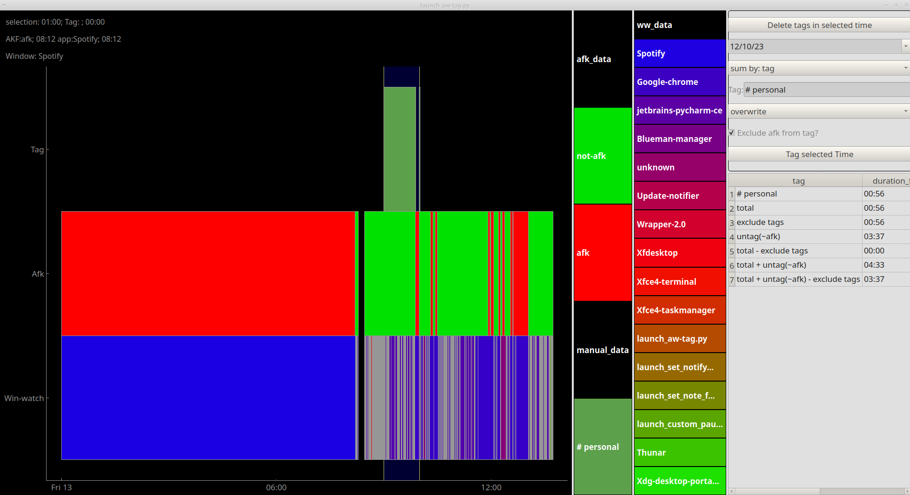

Activity Watch Manual Tag and Notification
#############################################

.. contents:: Table of Contents
    :depth: 3

Feature Overview
======================

This is a very quick and dirty UI build in pyqtgraph and pyQT6 to interact with ActivityWatch data and to implement ManicTime style manual time tagging on Linux as well as notifications when a certain amount of time has passed.  I have ADHD and if I dont have some sort of notification I will keep working until my wife yells at me, it's dark out, or I REALLY have to pee.

Key features:

1. Allow manual tagging of time using the ActivityWatch API
2. sum up time by tag, app, and afk/not-afk (useful for timesheeting)
3. Optional notifications when a certain amount of time has passed (useful for ADHD people like me)

NOTE: this was written primarily for personal use... I would not be surprised if there are bugs.  I have only tested this on Xubuntu 22.04, which is the linux distro I tend to use.  Other distros may or may not work.

Installation
===============

Install dependencies
-----------------------

There are a number of dependencies for this project:

Activity Watch
^^^^^^^^^^^^^^^^^

1. Install Activity watch:

* download the latest release: https://activitywatch.net/

.. code-block:: bash

    mkdir ~/ActivityWatchNoteTag
    # unzip:
    unzip {file.zip} -d ~/ActivityWatchNoteTag

2. add ~ActivityWatchNoteTag/activitywatch/aw-qt to autostart for more info see: https://docs.activitywatch.net/en/latest/getting-started.html#installation

.. code-block::
    1. super key --> session startup
    2. new --> name: ActivityWatch, command: ~/ActivityWatchNoteTag/activitywatch/aw-qt

Other Linux dependencies

.. code-block:: bash

    sudo apt install libxcb-cursor0 # for pyqtgraph
    sudo apt install mpg123  # used to play sound
    sudo apt install build-essential libdbus-glib-1-dev libgirepository1.0-dev  # for dbus

Install Activity Watch Manual Tag and Notification
^^^^^^^^^^^^^^^^^^^^^^^^^^^^^^^^^^^^^^^^^^^^^^^^^^^^^

To install the Activity Watch Manual Tag and Notification app:

.. code-block:: bash

    git clone https://github.com/hansonmcoombs/activitywatch_manual-tag.git ~/ActivityWatchNoteTag/activitywatch_manual-tag

Note there is no need to add this path to your python path, as the launcher script will do this for you.

Build the python interpreter
------------------------------

If you use conda to manage packages you can build the interpreter using the included conda environment file:

.. code-block:: bash

    conda env create --file ~/ActivityWatchNoteTag/activitywatch_manual-tag/python_env.yml

alternatively you can build the interpreter manually a loose list of dependencies is:
available in python_env.txt

Autostart setup
-----------------

1. add the following to autostart... for more info see: https://docs.activitywatch.net/en/latest/getting-started.html#installation

.. code-block::

    ~/ActivityWatchNoteTag/activitywatch/aw-qt

2. add [python bin] to autostart  # note that you may need to pass absolute paths if the .bashrc has not been sourced yet.

.. code-block::

    [python binary path] ~/ActivityWatchNoteTag/activitywatch_manual-tag/aw_notify_callable_proceses/launch_pannel_app.py

to access python binary (assuming you are using conda):

.. code-block::

    conda activate aw_qt_tag
    which python

.. code-block::
    1. super key --> session startup
    2. new --> name: ActivityWatch, command: ~/ActivityWatchNoteTag/activitywatch/aw-qt
    3. new --> name: ActivityWatchNoteTag, command: conda run -n aw_qt_tag python ~/ActivityWatchNoteTag/activitywatch_manual-tag/aw_notify_callable_proceses/launch_pannel_app.py

Usage
========

Panel app
-----------

The panel app acts as the gateway to all of the features.

Manual Tagging
----------------

Manual Tagging takes place in the Manual Tagging tab, which is launched from the pannel icon menu ('Launch TimeTag). The Manual Tagging tab has four main sections:

1. The Timeline
2. The legend
3. The tag editor
4. The sum time menu.

time is selected on the timeline (colors for the events are defined in the legend). The selected time is then tagged using the tag editor. The tag editor has a place to enter tags, delete tags, and options to support tagging. The sum time menu allows the user to sum time by tag, app, and afk/not-afk. The sum time menu also allows the user to exclude certain tags from the sum time calculations.

manual tags are written to the ActivityWatch datasets via the aw-client python library. The tags are written to a new bucket, which is also created. The bucket is named f'ui-manual_{socket.gethostname()}'. Tags are events, with one data attribute 'tag':str

Handling overlapping tags
^^^^^^^^^^^^^^^^^^^^^^^^^^^^^^^

There are three possible ways to handle manual tag overlaps. They are:

1. **"overwrite"**: if the new event overlaps with previous events then all events will deleted and replace with new events where the passed (new) event is kept completely and the overlapped events (old) are truncated to prevent any overlap in the database
2. **"underwrite"**: if the new event overlaps with previous events it will be truncated to prevent any overlapping data. The tag may be split into multiple events. Existing events will not be impacted.
3. **"raise"**: raises an exception to prevent saving overlapping data.

Excluding AFK time from tag
^^^^^^^^^^^^^^^^^^^^^^^^^^^^^^^

the exclude AFK checkbox will ensure that your tag only applies to time where you are not AFK (including time when there is no AFK data (e.g. the computer is off). This is useful if you have lots of short breaks or have only been working on a single task during the day.

Excluding tags from time sum / notifications
^^^^^^^^^^^^^^^^^^^^^^^^^^^^^^^^^^^^^^^^^^^^^^^

Any tag that begins with an octothorpe (#) is designated an 'exclude' tag. This means that the time will not be applied to certain sum times (e.g., "total - exclude tags") and will not count towards notifications. This is useful if you use your computer for something personal and don't want to count that time towards your day.

Deleting tags
^^^^^^^^^^^^^^^
move the selector so it overlaps with all tags that you want to delete and then click the "Delete Tags in selected time" button. This will delete all tags that overlap with the selector.

Notifications
----------------

Desktop and optionally text notification can be sent once you have worked a certain number of hours. In theory only one text should be sent per day, but this has not been extensively tested.

Enable/Disable Notifications
^^^^^^^^^^^^^^^^^^^^^^^^^^^^^^^

Desktop notifications are automatically enabled, but can be disabled by unchecking the "Enable Desktop Notifications" checkbox. SMS notifications are disabled by default, but can be enabled by providing both a phone number and a message in the notification setting section.

Notification Settings
^^^^^^^^^^^^^^^^^^^^^^^^^^^^^^^

There are two sets of notification settings, the frequency of notifications and all of the notificaiton parameters.

To set the frequency of notifications open the "Set Notification Frequency" from the panel menu and enter the frequency of notifications in minutes.  The default is 10 minutes.

The other notification parameters are set in the "Set Notify Params" menu.  The parameters are:

* "How many hours do you want to work": The number of hours before a notification is sent
* "After how many hours do you want to text the external number": The number of hours before a sms text is sent to an external mobile number
* "What is the external number you want to text": leave blank for no text, or the phone number you want to text
* "What is the message you want to send": leave blank for no text, or the message you want to send
* "How many minutes before the limit do you want to be notified": The number of minutes before the limit (how many hours do you want to work) is reached that you want to be notified... essentially a warning before the workday ends so that you can get things wrapped up.
* "What hour do you want to start receiving notifications": From what hour do you want to start receiving notifications (e.g. 8am), to stop notifications from sending overnight
* "What hour do you want to stop receiving notifications": From what hour do you want to stop receiving notifications (e.g. 5pm) to stop notifications from sending overnight
* "From what hour do you want to start counting hours (set high, e.g. 4am)": what hour in the day do you want to start counting hours (e.g. to define the workday break)
* "Textbelt key (default=textbelt, one free text per day)"

External Notifications
^^^^^^^^^^^^^^^^^^^^^^^^^^^^^^^

optionally after a certain amount of time has passed you can send a notification to your phone or another person's phone. This is useful if you have ADHD and need to be reminded to quit for the day.  You can specify the amount of time that needs to pass before a notification is sent, and you can specify the message that is sent.  the texting uses https://textbelt.com and assumes that you only will send 1 message from your IP address, which is free.  It will only send 1 text per day once you reach your limit.

you can specify whether tagged time is included in you total worked time, and you can
exclude tags by including a # in the tag (such as *"#personal"*) from your worked time.

Test mode
^^^^^^^^^^^^

Notifications can be a bit temperamental, so we have included a test mode to help you get things working. When test mode is enabled, the notification will be triggered every 10 seconds. This is useful for testing that your notification settings are correct. To enable test mode substitute:

.. code-block:: bash:

    [python bin] ~/activitywatch_manual-tag/launch_pannel_app.py True

instead of:

.. code-block:: bash:

    [python bin] ~/activitywatch_manual-tag/launch_pannel_app.py

Final Words
============

1. Thank you to the ActivityWatch team for implementing for their hard work
2. Sorry for the rough as guts nature of this gui... function over form, and I am not a gui developer.
3. If anyone wants to improve this, by all means feel free.
